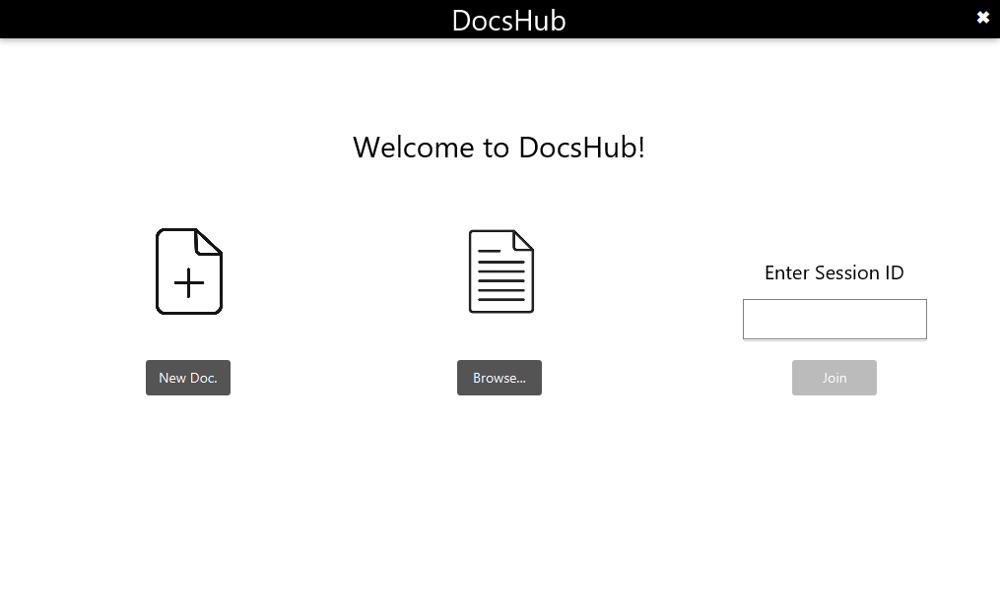
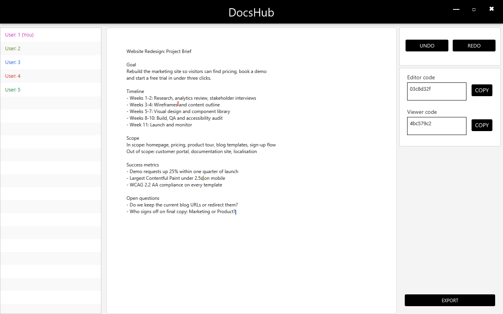
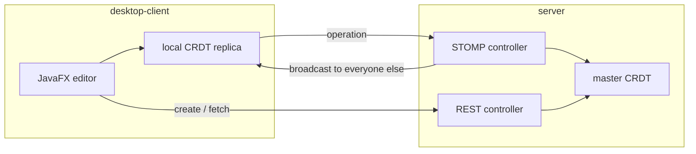

<div align="center">

# DocsHub

**Real-time collaborative text editing for the desktop.**

Several people open the same document, type at the same time, and every keystroke appears
in everyone else's window — each with their own cursor, in their own colour.

[](https://adoptium.net/)
[](https://openjfx.io/)
[](https://spring.io/projects/spring-boot)
[](#how-concurrent-editing-works)

</div>

---

## Overview

Concurrent edits are merged with a **CRDT** (Conflict-free Replicated Data Type). There is
no locking, no "last write wins", and no lost characters when two people type in the same
place at the same time — every replica converges on the same text regardless of the order
edits arrive in.

The project is two Maven modules:

| Module | Role |
| --- | --- |
| [`desktop-client/`](desktop-client) | JavaFX application — the editor, a STOMP client, and a local replica of the document |
| [`server/`](server) | Spring Boot service — holds documents, enforces edit permissions, broadcasts operations |

<table>
  <tr>
    <td width="50%"></td>
    <td width="50%"></td>
  </tr>
  <tr>
    <td align="center"><em>Start a document, open a file, or join with a code</em></td>
    <td align="center"><em>A live session: five participants, their cursors, and edits from several editors</em></td>
  </tr>
</table>

## Features

- **Live co-editing** — character-level operations broadcast over WebSocket, applied optimistically for instant local feedback
- **Presence** — everyone currently in the document, each with a colour, and their cursor drawn in the text
- **Two access levels** — an editor code grants read/write, a viewer code read-only; the server enforces it
- **Undo / redo** of your own operations, as CRDT operations rather than text snapshots
- **Import and export** — start a document from a `.txt`/`.md` file, save the result back to disk
- **Paste support** — multi-character input travels as a single operation

## Quick start

Requires **JDK 17+**. Maven is not needed globally; both modules ship the wrapper.

**1. Start the server** — listens on `http://localhost:8080`:

```bash
cd server && ./mvnw spring-boot:run
```

**2. Start a client** — run once per participant:

```bash
cd desktop-client && ./mvnw javafx:run
```

On Windows use `mvnw.cmd`. To collaborate, create a document in one client, copy its
**editor code**, and join from another.

## Configuration

The client defaults to `localhost:8080`. To point it elsewhere, copy
[`.env.example`](.env.example) to `.env` in the directory you launch from:

```properties
DOCSHUB_SERVER=collab.example.com:8080
```

`.env` is gitignored. Both `ws://<host>/ws` and `http://<host>/document/` are derived from
that one value, resolved in this order:

| Priority | Source | How to set it |
| --- | --- | --- |
| 1 | JVM system property | `-Ddocshub.server=host:8080` |
| 2 | Environment variable | `DOCSHUB_SERVER=host:8080` |
| 3 | `.env` file | `DOCSHUB_SERVER=host:8080` in the working directory |
| 4 | Built-in default | `localhost:8080` |

`./mvnw javafx:run` forks a JVM that inherits your environment but not Maven's `-D`
properties, so the environment variable is the simpler override there:

```bash
DOCSHUB_SERVER=collab.example.com:8080 ./mvnw javafx:run
```

TLS deployments need `wss://`/`https://`, a small change in
[`Config.java`](desktop-client/src/main/java/com/docshub/client/Config.java).

## How concurrent editing works

A document is not a string — it is a tree of character nodes, which is what makes
concurrent edits merge without coordination.



- Every character is a node with an id of the form `userId:clock`, unique across all
  clients without any coordination.
- An insert names **the character it follows** as its parent, never a numeric offset that a
  concurrent edit could invalidate.
- A delete sets a tombstone rather than unlinking the node, so ids stay stable for
  operations still in flight — and undo becomes a flag flip.
- Reading the text is an in-order walk, siblings sorted by descending clock then ascending
  user id. Every replica applies the same ordering, so all replicas converge.

Both sides run the same structure
([client](desktop-client/src/main/java/com/docshub/client/model/CRDT.java),
[server](server/src/main/java/com/server/model/CRDT.java)). The client applies an edit
locally for instant feedback and sends the operation; the server applies it to the master
copy and fans it out.

## Logging

Both modules log through SLF4J; neither writes to `System.out`. Levels come from
configuration, so tracing can be turned on without touching code.

| Level | Reports |
| --- | --- |
| `INFO` (default) | documents created, users joining and leaving, anything rejected |
| `DEBUG` | operations sent and applied, document name and imported size |
| `TRACE` | cursor movement |

**No log statement records document content or an access code.** Log lines carry ids only,
so a log can be shared without leaking a document or handing over edit access. The one
thing outside that guarantee is the text of an exception thrown by a third-party library,
logged verbatim at `ERROR`.

Server levels live in
[`application.properties`](server/src/main/resources/application.properties), client levels
in [`logback.xml`](desktop-client/src/main/resources/logback.xml).

## Protocol reference

<details>
<summary><strong>REST</strong></summary>

| Method | Path | Purpose |
| --- | --- | --- |
| `POST` | `/document/create` | Body `{ "name": "...", "content": "..." }`. Returns `documentId`, `documentName`, `editorCode`, `viewerCode`, `userId`, `userColor` and the serialized `crdt`. A blank `name` is rejected with `400` and a field-error map. |
| `GET` | `/document/{documentId}` | The document's serialized CRDT — a list of `{ id, value, deleted, parentId }` nodes. |

</details>

<details>
<summary><strong>WebSocket (STOMP over SockJS)</strong></summary>

Endpoint `/ws`; application prefix `/app`, broker prefixes `/topic` and `/queue`.

Client → server:

| Destination | Payload |
| --- | --- |
| `/app/join` | A document code. Replies on `/user/queue/join` with document and user info, or an `error`. |
| `/app/document/{documentId}/operation` | A `CrdtOperation`. Ignored unless the sender is an editor. |
| `/app/document/{documentId}/cursor` | `{ userId, position }` |
| `/app/document/{documentId}/users` | Empty. Replies on `/user/queue/users`. |
| `/app/leave` | `{ documentId, userId }` |

Server → clients:

| Destination | Sent when |
| --- | --- |
| `/topic/document/{documentId}/operation` | An operation was accepted and applied |
| `/topic/document/{documentId}/cursor` | Someone moved their cursor |
| `/topic/document/{documentId}/users` | Someone joined or left |

</details>

<details>
<summary><strong>Operation payload</strong></summary>

```java
record CrdtOperation(
    String   type,      // "insert" | "delete" | "undoDelete"
    String   userId,    // Who performed it
    String   clock,     // Logical clock, base for the node id
    String[] nodeId,    // Target nodes, or the nodes an insert created
    String   parentId,  // Character to insert after
    String   value      // Character(s) to insert - more than one for a paste
) {}
```

</details>

## Project layout

```
desktop-client/src/main/java/
├── module-info.java            JPMS module; opens the package to javafx.fxml
└── com/docshub/client/
    ├── HelloApplication.java   JavaFX entry point, loads main.fxml
    ├── SceneController.java    launcher: navigation and join-by-code
    ├── CreateController.java   "new document" screen
    ├── Browser.java            open a .txt/.md file from disk
    ├── DocumentController.java the editor: text, cursors, undo/redo, export
    ├── SocketController.java   STOMP client: subscriptions and outgoing operations
    ├── Config.java             resolves the server address
    ├── HelloController.java    unused, left over from the JavaFX template
    └── model/                  CRDT, CharacterNode, CrdtOperation, User

server/src/main/java/com/server/
├── ServerApplication.java
├── config/WebSocketConfig.java          STOMP endpoint and broker setup
├── controller/Controller.java           REST: create and fetch documents
├── controller/WebSocketController.java  join, operations, cursors, leave
├── service/DocumentService.java         in-memory document registry
├── model/                               Document, CRDT, CharacterNode, User
├── dto/                                 request records
└── exception/                           invalid-code handling
```

FXML layouts and images live in `desktop-client/src/main/resources/`.

## Known limitations

- **Nothing is persisted.** Documents live in a `ConcurrentHashMap`; restarting the server
  loses every document and its codes. Use **Export** to keep a copy.
- **Deleting a selection removes one character** from the document model, and forward
  <kbd>Delete</kbd> targets the character before the caret. Both diverge from what the text
  area shows.
- **No reconnection.** If the WebSocket drops, the client does not re-establish it.
- **Rejected operations are silent to the client** — the server logs them, but the sender
  is never told, so a rejection means permanent divergence.
- The FXML was authored against the JavaFX 23 API while the build pins 21.0.2, so startup
  logs a harmless version warning.
